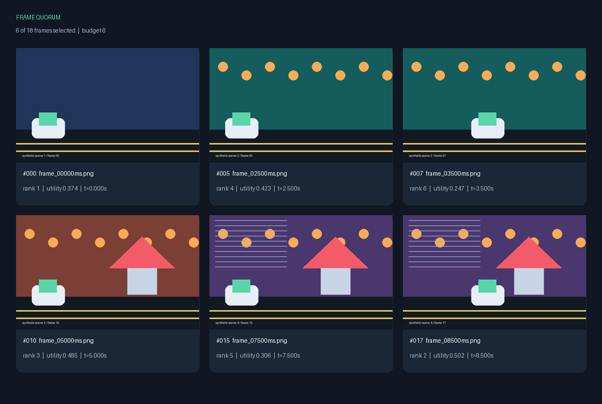

# Frame Quorum

Exact CFR timecodes and cuts-only editing exports are available through
`scenes --timecode-rate 30000/1001 --drop-frame --edl`.
See [timecodes and editing](docs/timecodes-and-editing.md) for rational timing,
sampling-coordinate limits and the supported EDL subset.

[](https://github.com/appleweiping/frame-quorum/actions/workflows/ci.yml)
[](https://github.com/appleweiping/frame-quorum/actions/workflows/codeql.yml)
[](https://www.python.org/)
[](LICENSE)

Frame Quorum selects a compact, explainable set of key frames from an image sequence. It favors meaningful
visual change, clear and information-rich images, and coverage across time while enforcing a frame budget,
minimum spacing, and near-duplicate suppression.

It works directly on image directories. There is no mandatory video decoder, model download, GPU, network
request, or hidden inference step. Every selected and rejected frame receives a machine-readable reason.



## Why use it?

For bounded online video decisions, use `native-change-stream`: it reports
exact-PTS HSV/gradient cuts with explicit confirmation delay, EOF and cancellation
semantics, without retaining the whole video statistics table. See
[online detection](docs/native-online.md) and its generated local demo.

- **Auditable selection:** the manifest records quality, change, coverage, total utility, rank, and reason.
- **Content-aware:** a structural difference hash is combined with mean color and luminance, avoiding the
  common failure where differently colored flat frames appear identical.
- **Constraint-aware:** budget, minimum time gap, endpoint preservation, and duplicate threshold are explicit.
- **Portable:** Python 3.11+ and Pillow are sufficient; input can be PNG, JPEG, WebP, BMP, or TIFF.
- **Reproducible:** discovery, scoring, tie-breaking, JSON layout, and the included demo are deterministic.
- **Bounded presentation:** metric sampling and contact-sheet canvas size have explicit memory guards.
- **Shot analysis:** `analyze_scenes()` detects representation-level shot boundaries and allocates a
  selection budget across shots deterministically; it is an auditable pre-selection signal, not a
  semantic scene classifier.

## Quick start

```bash
python -m venv .venv
# Linux/macOS: source .venv/bin/activate
# Windows PowerShell: .venv\Scripts\Activate.ps1
python -m pip install -e ".[dev]"

frame-quorum demo --output-dir demo-output
```

The demo creates 18 synthetic frames, `manifest.json`, and `contact-sheet.png`. It uses no downloaded data.
Recreate the repository's checked-in example exactly with:

```bash
python examples/create_demo.py
```

## Reproducible benchmark

Compare the production selector with temporal-uniform, change-peak, and deterministic seeded-random baselines under
the same budget, spacing, duplicate, and endpoint constraints:

```bash
frame-quorum benchmark ./frames --output-dir ./experiment --budget 8 --random-trials 32
```

The command writes a machine-readable `benchmark.json` and an SVG comparison chart. The repository includes a
checked-in [benchmark report](examples/benchmark/benchmark.json),
[visual result](examples/benchmark/benchmark.svg), metric definitions, baseline protocol, and honest evidence limits
in [Reproducible experiments](docs/experiments.md). Its algorithmic fields reproduce exactly from the fixture;
runtime-version fields intentionally describe the executing environment. These label-free diagnostics measure representation and
coverage;
they do not measure downstream VLM understanding or semantic accuracy. Every seeded-random trial is retained and
reported as a distribution instead of selecting the best trial.

## Commands

### Read native video without losing PTS

```bash
python -m pip install -e ".[video]"
frame-quorum native-scan local.mkv --start 5 --end 53/10 --max-frames 100
python examples/native_pts.py
```

The optional PyAV backend incrementally returns owned RGB snapshots with native
integer PTS and rational time bases, exact presentation-time windows, keyframe
seek/replay and lifetime work/output limits. The CLI emits measurement JSONL;
require its terminal summary and inspect the status before treating an output
prefix as complete. This is a local-file backend, not a native-code sandbox or
an automatic CFR/EDL conversion. See [contracts and limits](docs/native-video.md).

### Detect scenes directly from native video

```bash
frame-quorum native-scenes local.mkv --detectors adaptive luminance \
  --minimum-votes 2 --min-scene-samples 2 --max-frames 5000
python examples/native_scenes.py
```

The native scene workflow incrementally decodes, then applies the existing five
detectors to bounded retained measurements (not prior RGB frames). The JSON report
preserves exact native PTS, generation-local decode/sample mapping, each detector's
raw/qualified candidates and aggregate voting decisions. Sample counts are not
original-frame counts. A final time remains unknown at EOF or a count limit;
it is never inferred from FPS. This is offline `O(samples × detectors)` analysis,
not constant-memory online scene detection. See [native scene contracts](docs/native-scenes.md).

### Export a native scene cut list to OTIO

```bash
frame-quorum native-otio local.nut --media-origin 5 --final-end 57/10 \
  --detectors luminance --output-dir ./editor-cut-list
python examples/native_otio.py
```

The new directory contains `scenes.otio` and a digest/limits audit. Original PTS
are mapped by the explicitly supplied media origin; unknown final duration is
not guessed. Time fields use bounded exact integer ticks, unknown media
availability stays null, and audio is included only by an explicit unverified
caller declaration. This is editorial interchange, not media rendering or
multi-track relinking certification. See [OTIO contracts](docs/otio-export.md).

### Tune native scene thresholds without decoding again

```bash
frame-quorum native-measure local.mkv --output-dir ./measurements
frame-quorum native-replay ./measurements/measurements.fqm.jsonl \
  --detectors adaptive luminance --minimum-votes 2 --output-dir ./review-01
python examples/native_measurement_replay.py
```

The canonical bounded cache retains exact native coordinates, all fixed metrics,
source/configuration identity and termination provenance. Replay uses the same
detector kernel without opening the source, and publishes diagnostic JSON/CSV in
a new directory. Its explicit `source_verified=false` means historical-data
analysis, not freshly verified media. See [cache and replay contracts](docs/native-measurements.md).

### Compare full-pixel distributions and spatial layout

```bash
frame-quorum native-histogram-measure local.mkv --output-dir ./histogram-cache
frame-quorum native-histogram-replay ./histogram-cache/histograms.fqm.jsonl \
  --mode spatial --threshold 0.5 --output-dir ./histogram-review
python examples/native_pixel_histograms.py
```

RGB cell histograms retain complete per-channel pixel distributions, including
changes that mean-color/hash summaries can miss. Global mode ignores layout;
spatial mode compares relative cells. The separate bounded cache supports
no-decode threshold tuning without changing the old summary cache or claiming
source authentication. See [pixel histogram contracts](docs/native-pixel-histograms.md).

Corresponding-pixel HSV and gradient evidence detects changes even when the RGB
histograms stay identical. Capture once, then adjust weights or adaptive thresholds:

```bash
frame-quorum native-change-measure local.mkv --output-dir ./change-cache
frame-quorum native-change-replay ./change-cache/pixel-changes.fqm.jsonl \
  --weights 1 1 1 0 --threshold 0.3 --output-dir ./change-review
python examples/native_pixel_changes.py
```

The independent integer HSV/forward-gradient definition, V-only mode, exact pair
work/byte budgets and separate cache are described in the
[pixel change contracts](docs/native-pixel-changes.md). Cached results remain
source-unverified and cannot be supplied as fresh scene evidence to splitting.

### Split native video into verified clips

```bash
frame-quorum native-split local.mkv --output-dir ./new-clips \
  --clip 5 1001/100 --clip 1001/100 15 --max-frames 5000
python examples/native_splitting.py
```

This optional PyAV workflow creates actual FFV1/NUT video-only clips with exact
half-open native presentation bounds. Every output is reopened and its complete
frame count, rational timestamps and RGB hashes verified before a new directory
is atomically published without replacing existing destinations. A manifest
records each source/output frame mapping. Use `native_scene_clips()` for complete,
unsampled scene decisions; an unknown final endpoint needs a caller-supplied
exact bound. Audio, arbitrary codecs/containers and power-loss durability are
not claimed. See [native splitting](docs/native-splitting.md).

### Preserve exact video/audio synchronization in verified clips

```bash
frame-quorum native-av-split local.nut --output-dir ./new-av-clips \
  --clip 5 51/10 --video-stream 0 --audio-stream 0
python examples/native_av_splitting.py
```

The separate audio/video workflow writes FFV1 plus PCM16 in NUT, without
resampling, silence insertion or independent track re-zeroing. It selects
video frames and audio sample starts in each exact half-open interval, rebases
both tracks onto one source-audio-grid epoch, then independently reopens every
output to compare complete RGB/PTS and PCM/sample-grid evidence. Mono/stereo
decoded PCM16, fixed sample rate and little-endian hosts are required; it is
not arbitrary codec/container, subtitle or stream-copy support. All configured
limits and atomic no-replace publication apply to the complete clip directory.
See [the audio/video contract](docs/native-av-splitting.md).

### Inspect an image sequence

```bash
frame-quorum scan ./frames --output scan.json
```

`scan` discovers images in natural filename order (`frame_2` before `frame_10`), reads EXIF orientation,
extracts content measurements, and emits JSON. Add `--recursive` to include nested directories.

### Detect scene cuts and fades

```bash
frame-quorum scenes ./frames --detector adaptive --output-dir ./scenes \
  --window-radius 2 --adaptive-ratio 3 --min-content 0.15 --min-scene-frames 5
frame-quorum scenes ./frames --detector threshold --output-dir ./fades \
  --dark-threshold 0.05 --min-dark-frames 2
```

Adaptive detection compares each content change with surrounding changes.
Threshold detection tracks a transition through darkness until brightness
returns. Both write `scenes.json` and `statistics.csv`, retaining rejected
candidates and their reasons. The same workflow also supports `content`,
`luminance`, and `color` distance modes. Minimum scene lengths include both the
first and final scene. See [detector semantics and limits](docs/scene-detection.md)
and run `python examples/detect_scenes.py` for a self-contained example.

### Select key frames

```bash
frame-quorum select ./frames \
  --output-dir ./selection \
  --budget 8 \
  --min-gap 1.5 \
  --duplicate-threshold 0.035
```

Output consists of:

- `manifest.json`: every input frame, measurement, score, decision, and selected-frame summary;
- `contact-sheet.png`: the selected source pixels with index, rank, utility, and timestamp labels.

Endpoint preservation is enabled by default. Pass `--no-endpoints` when the first and last images are not
semantically meaningful. `--min-gap` uses seconds when timestamps exist and sequence indices otherwise.

### Extract timestamps from filenames

The default timestamp is `index / frame_rate`. For files such as `camera_004250ms.png`:

```bash
frame-quorum select ./frames --output-dir ./selection \
  --timestamp-mode filename \
  --timestamp-regex '_(?P<ts>\d+)ms$' \
  --timestamp-unit milliseconds
```

The regex may contain a named `ts` group or use its first capture group. Other policies are `exif`, `mtime`,
and `none`. A filename mismatch is an error rather than a silently invented timestamp.

### Infer capture time from EXIF

```bash
frame-quorum select ./photos --output-dir ./selection --timestamp-mode exif
```

`exif` reads capture time from the first populated tag in this precedence order:

| Order | Tag | Meaning | UTC offset tag |
| --- | --- | --- | --- |
| 1 | `DateTimeOriginal` | when the shutter fired | `OffsetTimeOriginal` |
| 2 | `DateTimeDigitized` | when the image was digitized | `OffsetTimeDigitized` |
| 3 | `DateTime` | when imaging software last wrote the file | `OffsetTime` |

The order runs from the most specific record of the capture event to the least. A tag that is absent, or that
holds the all-zero `0000:00:00 00:00:00` "not recorded" placeholder, is skipped. A tag that is *populated but
unreadable* — a wrong layout, an impossible date, a non-text value — is an error, because falling through to a
weaker tag would silently swap in a different meaning for a corrupt value.

EXIF capture times carry no time zone. When the matching offset tag holds a `+HH:MM` or `-HH:MM` value it is
applied; an absent or unset offset makes the value read as UTC. That is a normalization, not an inference:
selection consumes only differences between timestamps, so one unknown offset shared by the whole sequence
cancels out. Mixing sources from different zones without offset tags does not, and a sequence whose timestamps
then run backwards is rejected. A malformed offset is an error rather than a silent fall back to UTC. Sub-second
tags are not read, so EXIF capture time has one-second resolution.

### Expand animated images

Animated GIF, APNG, and WebP containers count as a single image until expansion is requested:

```bash
frame-quorum select ./clips --output-dir ./selection \
  --extensions gif png webp \
  --expand-animations \
  --max-animation-frames 64 \
  --max-animation-decoded-bytes 268435456
```

Each internal frame then becomes its own measured record with a path of the form `clip.gif#frame=3` and a
`source_frame_index` of `3`, so every decision traces back to both the container and the position inside it.
Expanded records share the container's file path and byte size. A container holding more frames than
`--max-animation-frames`, or whose estimated decoded RGB bytes exceed `--max-animation-decoded-bytes`, is
rejected with an error before any internal frame is read; the animation is never silently truncated.
`.gif` is not in the default extension set, so admit it with `--extensions`.

```python
from frame_quorum import AnimationConfig, ScanConfig, scan_frames

frames = scan_frames("clips", ScanConfig(extensions=(".gif",)), animation=AnimationConfig(max_frames=32))
```

Expanded frames follow the same timestamp policy as any other frame; with the default `index` mode they
advance by `1 / frame_rate`. Stored per-frame animation delays are not read.

### Scan large directories in parallel

Decoding dominates a scan, so a large directory can overlap it across worker threads:

```bash
frame-quorum scan ./frames --workers 8 --output scan.json
```

`--workers` is accepted by `scan`, `select`, and `benchmark`, and changes nothing observable. Discovery order,
frame indices, every metric, the manifest bytes, and the benchmark's measured-record fingerprint are identical
at every worker count. The count itself is an execution detail rather than a measurement input, so it is
deliberately absent from manifests: a report produced with eight workers is byte-identical to a sequential one.

The default is a single worker — strictly sequential — rather than a value derived from the host. Each worker
holds one fully decoded image, so a CPU-derived default would make thread count and peak memory vary by machine
for an unchanged command. Choose a count between 1 and 64 to suit the machine actually running the scan.

Failures stay order-stable. Sequential scanning stops at the first unreadable file in path order; a parallel scan
discovers failures out of order but consumes its results in path order, so it reports the same file with the same
message and then cancels the rest of the queue instead of reading on.

```python
from frame_quorum import ConcurrencyConfig, scan_frames

frames = scan_frames("frames", concurrency=ConcurrencyConfig(workers=8))
```

### Optional video extraction

If FFmpeg is installed, create a bounded, validated image sequence without adding a Python dependency:

```bash
frame-quorum extract input.mp4 --output-dir ./frames --frame-rate 2 --max-frames 10000 \
  --max-output-bytes 1000000000 --timeout 300
```

Extraction never invokes a shell, refuses symbolic-link inputs and outputs or an existing destination, monitors
generated PNG bytes while FFmpeg is running, enforces the frame and PNG-byte limits, validates all PNGs, and publishes
the directory atomically. `--timeout` limits the FFmpeg subprocess runtime; it does not include input hashing, version
probing, or post-decode validation. The manifest records the verified input SHA-256, actual FFmpeg version and
arguments, limits, and result. `max_output_bytes` and `total_output_bytes` count generated PNGs only and exclude the
small `extraction.json` record.

### Detector and export APIs

For representation-level shot boundaries, choose the signal that matches the
failure mode: `content` combines structure and color, `luminance` is useful for
fades, and `color` isolates palette changes.

```python
from frame_quorum import detect_transitions, render_decision_csv

transitions = detect_transitions(frames, detector="luminance", threshold=0.25)
csv_text = render_decision_csv(selection_result)
```

These detectors are intentionally not semantic scene classifiers. The CSV export
contains every frame, its reason code, and score breakdown so a reviewer can audit
why a frame was selected or rejected.

## How selection works

Each image is measured once:

1. A 64-bit horizontal difference hash captures low-frequency structure.
2. Mean RGB and luminance complement that hash for flat or low-texture scenes.
3. Grayscale entropy measures information variety.
4. Interior edge energy estimates sharpness.
5. Chroma spread estimates colorfulness.

The selector reserves admissible endpoints, then greedily fills the remaining budget. At each step it scores
an eligible frame using three normalized terms:

```text
utility = quality_weight × quality
        + change_weight  × change_from_previous
        + coverage_weight × distance_from_selected_times
```

Weights are normalized by their sum. A candidate is ineligible when it is closer than `min_gap` to an already
selected frame or its combined content distance is at or below `duplicate_threshold`. Equal scores are resolved
by content change and then sequence index, making repeated runs stable.

This is an interpretable heuristic, not semantic understanding. See [architecture and algorithm boundaries](docs/architecture.md).

## Python API

```python
from frame_quorum import ScanConfig, SelectionConfig, scan_frames, select_frames

frames = scan_frames("frames", ScanConfig(frame_rate=2.0))
result = select_frames(frames, SelectionConfig(budget=6, min_gap=1.0))

for frame in result.selected_frames:
    decision = result.decision_for(frame.index)
    print(frame.relative_path, decision.reason)
```

The records are frozen dataclasses. The selector never modifies the source images or copies them into its output.
Selection, manifest, and contact-sheet operations validate documented field bounds and result structure, including
records constructed directly. Invalid values raise `ConfigurationError` instead of leaking interpreter-specific
conversion failures.

## Manifest contract

Manifests declare `schema_version: "1.0"` and `kind`. Floating-point score fields are rounded to six decimal
places. Paths are relative to the scanned input root. The selection manifest includes both a concise `selected`
list and the complete frame list with decisions, allowing consumers to audit rejection as well as inclusion.

Integer identifiers, budgets, ranks, dimensions, and byte counts use the non-negative signed 64-bit range
(`0` through `2^63 - 1`), with strictly positive lower bounds where zero has no meaning. Perceptual hashes are
unsigned 64-bit values. Aggregate byte counts must also fit the signed 64-bit range. These explicit bounds keep
validation and JSON behavior stable across supported Python versions, including for directly constructed records.
Continuous numeric settings and timestamps accept finite floating-point values. When supplied as Python integers,
they must fit the signed 64-bit range so every accepted value also has a stable JSON representation.

A frame's `source_frame_index` and a manifest's `animation_config` are present only when animated-image
expansion produced them, so manifests for ordinary single-image inputs are byte-identical to earlier releases.

Minor releases may add fields. Removing or changing field meaning requires a schema-version change.

## Development

```bash
python -m pip install -e ".[dev]"
python -m ruff check .
python -m ruff format --check .
python -m pytest --cov
```

Tests synthesize their own images and make no network requests. CI runs the full suite on Linux with Python 3.11
through 3.14, plus Windows with Python 3.12. The coverage floor is 95% with branch coverage enabled.

For regression research, regenerate the checked-in benchmark and run the machine-readable selection-only performance
protocol documented in [benchmarks/README.md](benchmarks/README.md).

See [CONTRIBUTING.md](CONTRIBUTING.md), [GOVERNANCE.md](GOVERNANCE.md), the
[release verification guide](docs/releases.md), and [citation metadata](CITATION.cff) for the
project's public maintenance and release contracts.

## What the selection missed

The manifest says why each frame was kept or dropped, which answers "was this
decision defensible" and not "did the result miss anything". A budget of eight
can be filled with eight defensible choices and still leave a whole event
unrepresented.

```console
frame-quorum coverage frames/ --budget 6 --budgets 2 4 6 8 12 16
```

```
kept 6 of 18; worst gap 0.274, mean 0.172, 0% of dropped frames within 0.035
  frames 1-4 are represented no closer than 0.274
  frames 11-14 are represented no closer than 0.189

 budget  kept   worst    mean
      2     2   0.298   0.191
      4     4   0.274   0.168
      6     6   0.274   0.172
      8     8   0.223   0.166
     12    12   0.203   0.154
     16    16   0.203   0.190
  the worst gap stops improving at a budget of 12
```

Representation error is the distance from each dropped frame to the nearest one
that was kept, in the same content metric the selector already uses to detect
duplicates. Using a second notion of "similar" would let a selection look well
represented under one measure while the selector rejected duplicates under
another, and the disagreement would be invisible.

Consecutive under-represented frames are reported as one gap. A missed event
shows up as a stretch of neighbouring frames, all far from anything kept, and
listing them one by one would describe a single absence many times.

### Choosing a budget

The budget is the one setting picked with no basis, and the curve is the basis.
A worst gap that keeps falling as frames are added says the budget is binding;
one that flattens says it is not, and the extra frames are being spent on
moments already covered. A curve still improving at its largest budget reports
no knee rather than naming the last point, which would invent a plateau.

The curve reports frames *kept*, not frames asked for. A budget past the length
of the sequence, or one the minimum gap cuts short, selects fewer than it
requested, and reporting the request would make the curve look flat for the
wrong reason.

### Reading the demo numbers

On the bundled demo every frame is a distinct scene, so at the selector's own
duplicate threshold no dropped frame is covered at any budget and the covered
column reads zero throughout. That is a fact about the sequence rather than
about the selection: a budget of six cannot represent eighteen distinct moments,
and the worst gap is then a statement about the budget. `--covered-distance`
sets the threshold when a looser notion of "close enough" is wanted.

## Limitations

- A perceptual change is not necessarily an important event; the tool does not recognize people or objects.
- Sharp text, overlays, camera flashes, and cuts can receive high change or quality scores.
- Animated image formats are one image file by default. `--expand-animations` opts into internal-frame
  expansion under explicit frame and decoded-byte limits, and reads no per-frame animation delays.
- EXIF capture time is opt-in through `--timestamp-mode exif`, has one-second resolution, and reads an undeclared
  zone as UTC. Where EXIF is absent or untrusted, use a filename rule, modification time, or indexed frame rate.
- Directories are scanned sequentially unless `--workers` asks for more. Extra workers overlap file decoding
  only: images are still downsampled for metrics, each file is still decoded exactly once, and peak memory grows
  with the worker count because every worker holds one fully decoded image.
- The contact sheet reads selected source images again to preserve visual quality and rejects files whose
  dimensions, size, or measured content changed after scanning.
- Filename timestamp regular expressions are caller-supplied Python regular expressions; do not accept an
  arbitrary pattern from an untrusted tenant without an external execution timeout.
- The included benchmark uses label-free diagnostics on a synthetic fixture. It cannot establish semantic event
  detection, downstream VLM accuracy, or generalization to real video domains.
- Optional FFmpeg extraction is bounded by frame count, live generated-PNG bytes, and FFmpeg subprocess runtime.
  Input hashing, version probing, and post-decode validation are outside that subprocess timeout. Codec behavior,
  seeking, memory, and CPU use still depend on the separately installed FFmpeg build and OS sandbox.

These boundaries are deliberate: the baseline stays inspectable, offline, and inexpensive. Semantic embeddings
can be added later behind an optional adapter without changing the manifest's decision model.

## Privacy and security

Frame Quorum is local-only and does not transmit images. Treat manifests as potentially sensitive because file
names, dimensions, timestamps, and image statistics may reveal information. Review [SECURITY.md](SECURITY.md)
before processing untrusted or confidential files. Selection output must be outside the scanned input directory,
so generated reports cannot become inputs on a later run.

## Companion repositories

Frame Quorum is one independent part of a small multimodal tooling suite. [Payload Palette](https://github.com/appleweiping/payload-palette) validates request media, [Evidence Braid](https://github.com/appleweiping/evidence-braid) fuses evidence under explicit policies, [Graph Sail](https://github.com/appleweiping/graph-sail) plans heterogeneous DAGs, and [Stream Quilt](https://github.com/appleweiping/stream-quilt) aligns event streams. The repositories have separate contracts and release cycles; no runtime dependency is implied.

## License

[MIT](LICENSE)
