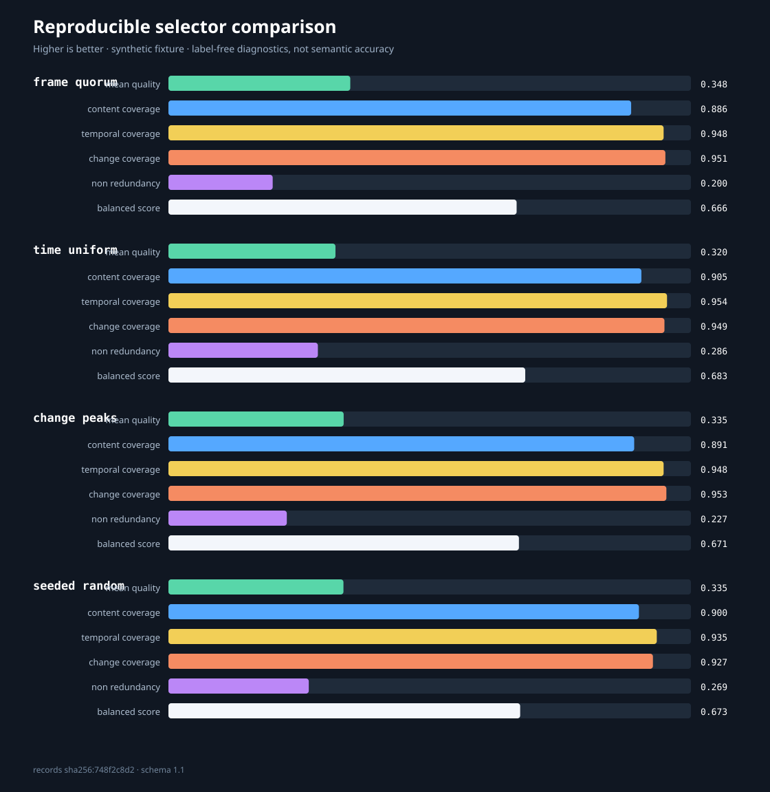

# Reproducible experiments

Frame Quorum ships a small offline protocol for comparing selector behavior before applying it to a domain dataset.
It makes algorithm changes falsifiable: the input fingerprint, method definitions, constraints, seeds, per-trial
selections, aggregate means, and population standard deviations are written to JSON.



## Research question

Given the same sequence, frame budget, endpoint policy, minimum spacing, and duplicate threshold, how do different
transparent candidate-ordering strategies trade off image quality, visual representation, temporal coverage,
transition coverage, and redundancy?

The protocol compares:

- `frame_quorum`: the production dynamic quality/change/coverage heuristic;
- `time_uniform`: frames closest to evenly spaced anchors over the actual `time_coordinate` range;
- `change_peaks`: largest predecessor-to-current content changes first;
- `seeded_random`: SHA-256-ranked candidates over eight declared seeds by default.

All four methods reserve endpoints under the same policy and reject the same minimum-gap and near-duplicate
violations. The portable hash-based random ordering is stable across Python versions; it is not cryptographic random
sampling and is not presented as such. All seeded-random trials are retained and summarized as a distribution. The
report never selects or highlights the best random trial.

## Metrics

Every metric is normalized to `[0, 1]`, where higher is better:

| Metric | Definition |
|---|---|
| Mean quality | Average `0.45 × sharpness + 0.35 × entropy + 0.20 × colorfulness` of selected frames. |
| Content coverage | Mean `1 - content_distance` to the nearest selected frame over all frames. |
| Temporal coverage | Mean `1 - normalized temporal distance` to the nearest selection. |
| Change coverage | Transition-change-weighted temporal proximity to a selection. |
| Non-redundancy | Mean pairwise content distance among selected frames; defined as 1 for a single selection. |
| Balanced score | Unweighted mean of the five diagnostics above. |

The balanced score is a convenience summary, not accuracy and not a learned objective. Report the component metrics
when comparing methods because the equal weighting is a declared policy choice.

## Reproduce the bundled fixture

```bash
python examples/create_demo.py
python examples/run_benchmark.py
git diff --exit-code -- examples/benchmark
```

The algorithmic fields in the resulting [JSON report](../examples/benchmark/benchmark.json) and
[SVG chart](../examples/benchmark/benchmark.svg) are deterministic. Runtime version fields deliberately describe
the current environment. Tests normalize those fields, regenerate the report from the checked-in frames, and compare
the remaining parsed content exactly.
The fixture contains controlled color phases, motion, added objects, repeated scene structure, and increasing detail.

The checked-in 18-frame, six-selection result is:

| Method | Trials | Quality | Content | Temporal | Change | Non-redundancy | Balanced |
|---|---:|---:|---:|---:|---:|---:|---:|
| Frame Quorum | 1 | 0.348020 | 0.885577 | 0.947712 | 0.951078 | 0.199539 | 0.666385 |
| Time uniform | 1 | 0.319665 | 0.905162 | 0.954248 | 0.949312 | 0.286007 | 0.682879 |
| Change peaks | 1 | 0.335349 | 0.891409 | 0.947712 | 0.952997 | 0.226564 | 0.670806 |
| Seeded random mean | 8 | 0.334958 | 0.900443 | 0.934641 | 0.927274 | 0.268607 | 0.673185 |

The seeded-random balanced-score population standard deviation is `0.006627`; all trial values remain in the JSON.
On this fixture, time-uniform selection has the highest declared balanced diagnostic while Frame Quorum has the highest
mean intrinsic quality. This is a fixture-specific tradeoff, not a ranking claim. It also demonstrates why component
metrics and honest baselines are more useful than presenting only a favorable aggregate.

To evaluate another image sequence:

```bash
frame-quorum benchmark ./frames --output-dir ./experiment --budget 8 \
  --random-seed 1729 --random-trials 32
```

Keep the complete output, raw source-content digest, measured-record fingerprint, scan configuration, and software
provenance with any reported result. The source digest hashes file bytes and relative names; the record fingerprint
hashes lossy measurements and is not an original-data hash. Pre-register the frame budget and constraints
for a serious comparison instead of tuning them after seeing the benchmark. To keep accidental batch jobs bounded,
the conservative work estimate may not exceed 100 million units. It upper-bounds candidate comparisons, metric
evaluation, and one complete integrity validation; split larger studies into declared sequences and aggregate them.

## Performance

Selection-only throughput over precomputed records can be measured separately:

```bash
python benchmarks/run_performance.py --frames 10000 --budget 8 --repeats 5
```

The runner emits machine-readable environment and timing data. Timings are deliberately excluded from the checked-in
quality artifact because they vary by machine. See [the performance protocol](../benchmarks/README.md).

## Video adapter

The core continues to require only Pillow. When an FFmpeg executable is available, a bounded adapter can create a
new image sequence without shell execution or destination overwrites:

```bash
frame-quorum extract input.mp4 --output-dir extracted --frame-rate 2 --max-frames 10000 \
  --max-output-bytes 1000000000 --timeout 300
frame-quorum benchmark extracted --output-dir experiment --frame-rate 2
```

The adapter monitors generated PNG bytes while decoding, terminates FFmpeg on the declared PNG-byte or subprocess
runtime limit, retains at most 16 KiB of continuously drained stderr, validates every PNG, and atomically publishes the
directory. It hashes the input before and after decoding and rejects identity, timestamp, size, or digest changes.
`max_output_bytes` and `total_output_bytes` cover generated PNGs and exclude `extraction.json`; the manifest states
that scope explicitly. The subprocess timeout does not include input hashing, version probing, or post-decode
validation. `extraction.json` records the input SHA-256, FFmpeg version and actual argument template, limits, sampling,
and result.

## Evidence boundaries

The bundled experiment is a protocol and regression fixture, not evidence of general superiority. It has no human
event annotations, independent datasets, domain stratification, or confidence interval over real videos. In
particular, none of these label-free metrics measures downstream VLM understanding, question-answering accuracy,
semantic event recall, or task utility.

A publishable evaluation still needs licensed external datasets, pre-declared event labels, multiple content domains,
semantic event recall/precision, downstream VLM evaluation, sensitivity analysis for budgets and thresholds,
decoder-version provenance, and independent replication. Those gaps are kept explicit rather than replaced with
synthetic performance claims.
